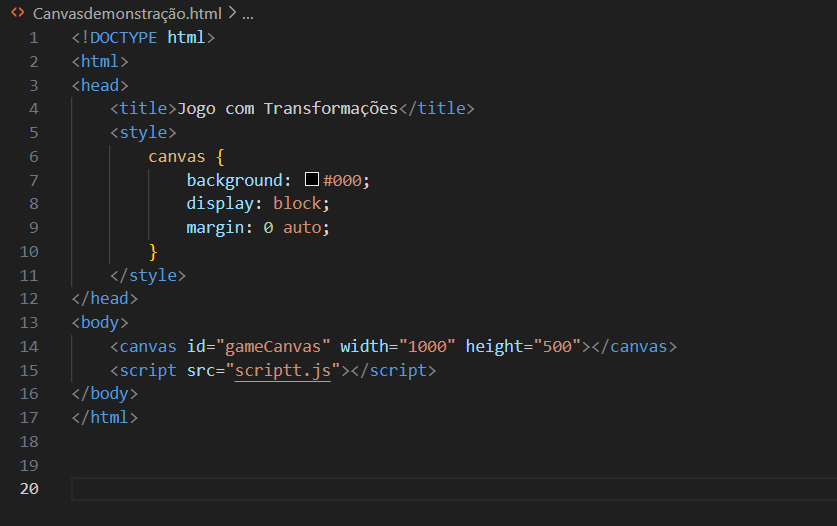

# Transformações-no-canvas DUPLAS: GABRIEL TOLEDO E JULIANA LISBOA

Pesquisa e demonstração de como funcionam as funções de transformação no canvas

<h1>Desenvolvimento do código</h1>

<h2>Primeiro passo:</h2>
Criação do HTML, contendo o <head>, um <title>, o <style> e o <body>. 
Dentro do style tem a mudança de cor de fundo, definimos a margin (espaçamento externo) e no Body chamamos o id do canvas denominado por "gameCanvas".
No script contém o link do código em Javascript.
 
  

 

<h2>Segundo passo:</h2>

Agora no código script, começamos definindo as variáveis. Dentre elas estão a bola, a raquete, os tijolos, os pontos e a vida do jogador.
Como mostra a imagem abaixo:

<h2>Terceiro passo:</h2>
Definir os eventos de controle no teclado, ou seja, definir que ao clicar por exemplo a seta para cima ele aumenta o tamanho da bola.
- seta para direita:  +10px
- seta para esquerda: -10px
- seta para cima: +0.1(aumenta a escala da bola)
- seta para baixo: -0.1 (diminui)

<h2>Quarto passo:</h2>
Funções para desenhar a bola e a raquete. Na bola foi usado as funções translate, rotate, scale e Clipping Path. Além de nos dois desenhos tem a mudança de cor e tamanho.

<h2>Quinto passo:</h2>
Para definir a colisão, queremos criar uma função de detecção de colisão que percorrerá todos os tijolos e comparará a posição de cada tijolo com as coordenadas da bola à medida que cada quadro é desenhado. Para melhor legibilidade do código definiremos a bvariável para armazenar o objeto tijolo em cada loop de detecção de colisão:

Se o centro da bola estiver dentro das coordenadas de um dos nossos tijolos, mudaremos a direção da bola. 

Agora precisamos envolver a status propriedade brick na collisionDetection()função: se o brick estiver ativo (seu status é 1) verificaremos se a colisão acontece; se ocorrer uma colisão, definiremos o status do tijolo fornecido 0para que ele não seja pintado na tela. 
Mensagem vencedor: A document.location.reload()função recarrega a página e inicia o jogo novamente assim que o botão de alerta é clicado.

<h2>Sexto passo:</h2>
Contando a pontuação: Desenha-se um texto. A definição da fonte é exatamente igual à do CSS – você pode definir o tamanho e o tipo da fonte no font()método. Em seguida, use fillStyle()para definir a cor da fonte e fillText()definir o texto real que será colocado na tela e onde será colocado. 

Para atribuir uma pontuação cada vez que um tijolo é atingido, adicione uma linha à collisionDetection()função para aumentar o valor da variável pontuação cada vez que uma colisão for detectada. Chamar drawScore()a partir da draw()função mantém a pontuação atualizada a cada novo quadro.

Dando vidas:Desenhar o contador de vidas é quase igual a desenhar o contador de pontuação.

Em vez de encerrar o jogo imediatamente, diminuiremos o número de vidas até que elas não estejam mais disponíveis. Também podemos redefinir as posições da bola e da raquete quando o jogador começar sua próxima vida.Com isso, podemos adicionar uma lógica um pouco mais complexa, conforme mostrado abaixo:

 
Agora, quando a bola atinge a borda inferior da tela, subtraímos uma vida da livesvariável. Se não houver mais vidas, o jogo está perdido; se ainda restarem algumas vidas, a posição da bola e da raquete são redefinidas, junto com o movimento da bola.

<h2> Finalizando: </h2>

Para finalizar, fazemos a atualização de bola, para onde ela deve voltar, chamamos as funções para serem executadas e usamos o  updateGameArea(); para dar inicio ao jogo.

Utilizando esses conceitos, fizemos um jogo de "ping pong" inspirado em um jogo conhecido pelo nome "breakout", sendo o objetivo do jogo usar a raquete para rebater a bolinha e a bolinha quebrar os tijolos, caso a bolinha passe para baixo da raquete o jogador perde 1 vida, tendo um total de 2 vidas.

