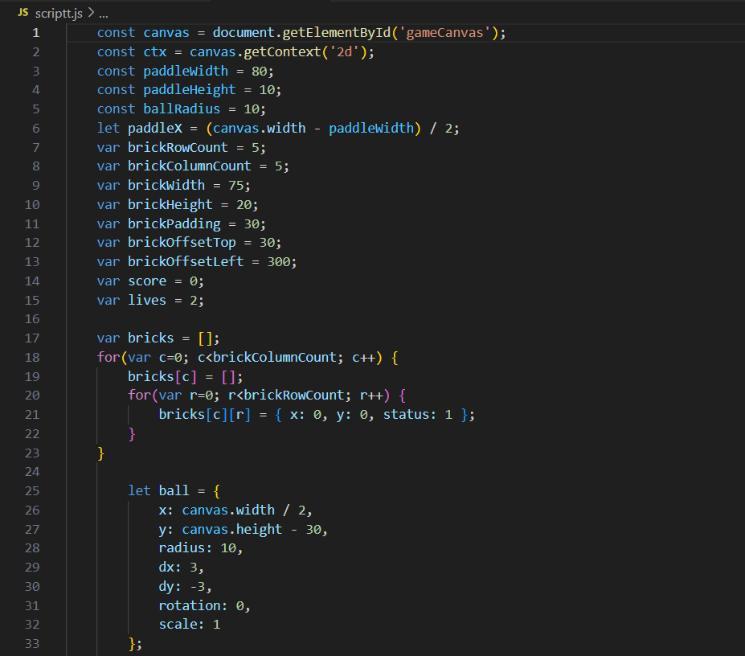

# Transformações-no-canvas DUPLAS: GABRIEL TOLEDO E JULIANA LISBOA

Pesquisa e demonstração de como funcionam as funções de transformação no canvas

<h1>Desenvolvimento do código</h1>

<h2>Primeiro passo:</h2>
<h5>Criação do HTML, contendo o <head>, um <title>, o <style> e o <body>. 
Dentro do style tem a mudança de cor de fundo, definimos a margin (espaçamento externo) e no Body chamamos o id do canvas denominado por "gameCanvas".
No script contém o link do código em Javascript.
 
  

 

<h2>Segundo passo:</h2>

Agora no código script, começamos definindo as variáveis. Dentre elas estão a bola, a raquete, os tijolos, os pontos e a vida do jogador.
Como mostra a imagem abaixo:

<h2>Terceiro passo:</h2>
Definir os eventos de controle no teclado, ou seja, definir que ao clicar por exemplo a seta para cima ele aumenta o tamanho da bola.
- seta para direita:  +10px
- seta para esquerda: -10px
- seta para cima: +0.1(aumenta a escala da bola)
- seta para baixo: -0.1 (diminui)

